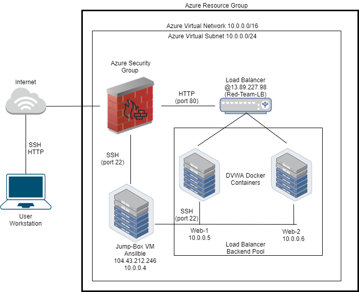
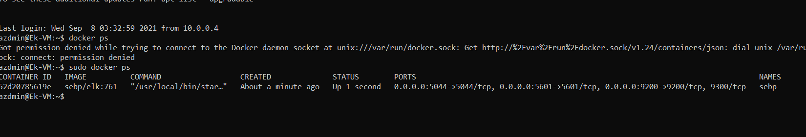

## Automated ELK Stack Deployment

The files in this repository were used to configure the network depicted below.

These files have been tested and used to generate a live ELK deployment on Azure. They can be used to either recreate the entire deployment pictured above. Alternatively, select portions of the files may be used to install only certain pieces of it, such as Filebeat.

 [a link](Ansible/files/filebeat-config.yml)

This document contains the following details:
- Description of the Topology
- Access Policies
- ELK Configuration
  - Beats in Use
  - Machines Being Monitored
- How to Use the Ansible Build

### Description of the Topology

The main purpose of this network is to expose a load-balanced and monitored instance of DVWA, the D*mn Vulnerable Web Application.

Load balancing ensures that the application will be highly distributed, in addition to restricting high amounts of traffic to the network.

- What aspect of security do load balancers protect? What is the advantage of a jump box?

Integrating an ELK server allows users to easily monitor the vulnerable VMs for changes in the traffic and in the system usage and logs.
- _TODO: What does Filebeat watch for?_
- _TODO: What does Metricbeat record?_

The configuration details of each machine may be found below.
_Note: Use the [Markdown Table Generator](http://www.tablesgenerator.com/markdown_tables) to add/remove values from the table_.

| Name     | Function   | IP Address | Operating System |
|----------|----------  |------------|------------------|
| Jump Box | Gateway    | 10.0.0.4   | Linux            |
| Web-1    | Web Server | 10.0.0.5   | Linux            |
| Web-2    | Web Server | 10.0.0.6   | Linux            |
| ELK      | Log Server | 10.1.0.5   | Linux            |

### Access Policies

The machines on the internal network are not exposed to the public Internet. 

Only the load balance machine can accept connections from the Internet. Access to this machine is only allowed from the following IP addresses:
- All IPs , for now.

Machines within the network can only be accessed by Gateway machine.
- Which machine did you allow to access your ELK VM? What was its IP address?
    Jump Box, 10.0.0.4

A summary of the access policies in place can be found in the table below.

| Name     | Publicly Accessible | Allowed IP Addresses |
|----------|---------------------|----------------------|
| Jump Box | Yes                 | All                  |
| Web-1    | No                  | 10.0.0.4             |
| Web-2    | No                  | 10.0.0.4             |
| Elk      | No                  | 10.0.0.4             |
### Elk Configuration

Ansible was used to automate configuration of the ELK machine. No configuration was performed manually, which is advantageous because it saves time.
- _TODO: What is the main advantage of automating configuration with Ansible?_
Easy to configure machines based on requirements.

The playbook implements the following tasks:
- _TODO: In 3-5 bullets, explain the steps of the ELK installation play. E.g., install Docker; download image; etc._
- Install docker 
- Install pip 
- Increase virtual memory
- Install docker module for python.
- Download and start a container.

The following screenshot displays the result of running `docker ps` after successfully configuring the ELK instance.

### Target Machines & Beats
This ELK server is configured to monitor the following machines:
  10.0.0.5,  10.0.0.6

We have installed the following Beats on these machines:
  Filebeat, Metricbeat

These Beats allow us to collect the following information from each machine:
 Filebeat collects system logs and Metricbeat collects metrics about usage. 

### Using the Playbook
In order to use the playbook, you will need to have an Ansible control node already configured. Assuming you have such a control node provisioned: 

SSH into the control node and follow the steps below:
- Copy the elk.yml file to /etc/ansible/.
- Update the hosts file to include the group affected by the playbook, i.e elk 
- Run the playbook, and navigate to http://40.118.227.102:5601 to check that the installation worked as expected.

_As a **Bonus**, provide the specific commands the user will need to run to download the playbook, update the files, etc._